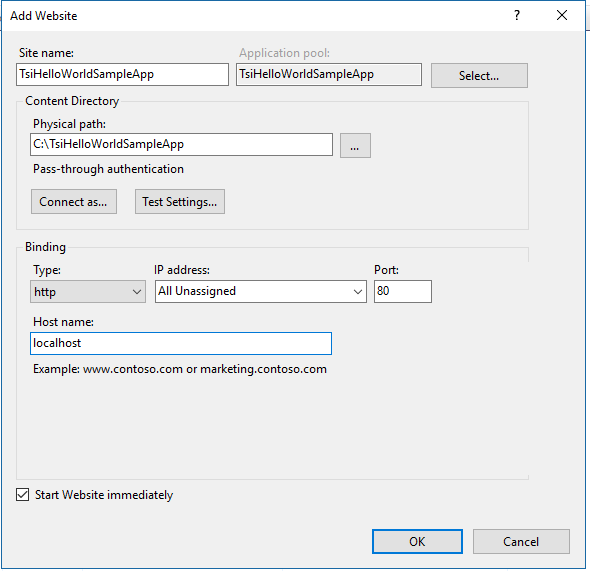

# Introduction

This sample shows how to create a simple single page web application in JavaScript that uses Time Series Insights Query API and does not require any server-side code.

# Setup

This article explains how to configure a custom application that calls the Azure Time Series Insights API.

## Create Azure Active Directory Application

Follow the [Authentication and authorization](https://docs.microsoft.com/azure/time-series-insights/time-series-insights-authentication-and-authorization#summary-and-best-practices) documentation to register your application in Azure Active Directory.

## Setting up TSI Hello World Sample Application on IIS 
 
1. Enable IIS if not already enabled - see [Turn on IIS in Windows 10](http://www.betterhostreview.com/turn-on-iis-windows-10.html) 
1. Download sample zip file and extract to a file location (e.g. `C:\TsiHelloWorldSampleApp`) 
1. Create a new web site with 
    - Physical path: C:\TsiHelloWorldSampleApp
    - Binding Type: http
    - IP address: All unassigned
    - Port: 80
    - Host name: localhost
    
    []

1. Allow IIS **AppPool\DefaultAppPool** access to your sample folder (e.g. `C:\TsiHelloWorldSampleApp`)  
1. Edit `C:\TsiHelloWorldSampleApp\index.html` and populate **clientId** with application ID and **postLogoutRedirectUri** to be the same as in application registration.
1. Navigate to [http://localhost/](http://localhost/) in your browser.

## See also

* The [Azure Time Series Insights API reference](https://docs.microsoft.com/rest/api/time-series-insights/ga) documentation for all General Availability REST APIs.

* Follow the [Authentication and authorization](https://docs.microsoft.com/azure/time-series-insights/time-series-insights-authentication-and-authorization#summary-and-best-practices) documentation to register your application in Azure Active Directory.

* The [TSI JS client SDK](https://github.com/microsoft/tsiclient/blob/master/docs/API.md).
